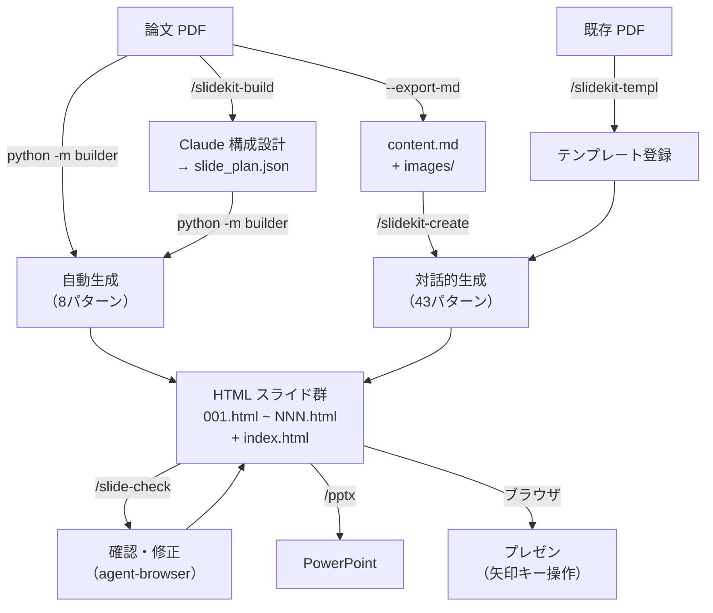

# SlideKit (Modified)

[nogataka/SlideKit](https://github.com/nogataka/SlideKit) をベースに、**論文 PDF からの学会スライド自動生成**機能を追加した派生版です。

元の SlideKit の対話的スライド作成（`/slidekit-create`）に加え、PDF を入力するだけでセクション分割・図版抽出・レイアウト選択・HTML 生成まで自動で行えます。

---

## オリジナルからの追加機能

| 機能 | 説明 |
|------|------|
| **builder/** | 論文 PDF → SlideKit HTML 自動生成パイプライン（Python） |
| **/slidekit-build** | Claude が構成設計 → slide_plan.json 作成 → ビルダー実行するスキル |
| **/slide-check** | agent-browser による対話的スライド確認・修正スキル |
| **--export-md** | PDF 内容を Markdown に書き出し、`/slidekit-create` に渡す高品質モード |
| **--poster** | 学会ポスター生成（A0 3カラム / A1 2カラム、Tailwind grid） |
| **言語選択** | `/slidekit-create`, `/slidekit-build` に日本語/英語選択ステップを追加 |
| **awesome-design-md** | Stripe, Notion 等のデザインシステム参照（submodule） |

---

## クイックリファレンス

```bash
# ── セットアップ ──
pip install pymupdf Pillow                       # Python 依存
# openpyxl, vl-convert-python は任意

# ── 自動生成（CLI 一発） ──
cd /path/to/slidekit
python -m builder paper.pdf                      # PDF → 15〜20枚のスライド
python -m builder ./input_folder/                # フォルダ入力
python -m builder slide_plan.json                # 構成済みプランから生成

# ── 高品質モード（slidekit-create 連携） ──
python -m builder paper.pdf --export-md          # Markdown + 画像を書き出し
# → /slidekit-create で content.md を読み込み、43 パターンでスライド生成

# ── オプション ──
python -m builder paper.pdf --theme medical-teal # テーマ指定
python -m builder paper.pdf --output ./my_deck/  # 出力先指定

# ── ポスター生成 ──
python -m builder paper.pdf --poster             # A0 3カラム（デフォルト）
python -m builder paper.pdf --poster --size a1   # A1 2カラム

# ── Claude Code スキル ──
# /slidekit-create    対話的スライド新規作成（43 パターン）
# /slidekit-build     論文 → 構成設計 → 自動生成
# /slide-check        スライド確認・修正（agent-browser）
# /slidekit-templ     PDF → テンプレート変換
# /pptx              PPTX 変換
```

---

## 全体像



---

## 使い方

### 方法 1: CLI で自動生成

```bash
python -m builder paper.pdf
```

出力先は自動で `output/<入力名>_YYYYMMDD_HHMM/` に作成されます。

```
output/mizuno_20260407_2130/
├── 001.html ~ 015.html    ← 個別スライド
├── index.html             ← ビューア
└── images/                ← 抽出画像
```

ブラウザで `index.html` を開けばすぐにプレゼンできます。

| 操作 | キー |
|------|------|
| 次のスライド | → / Space / クリック |
| 前のスライド | ← |
| フルスクリーン | F |
| PDF 保存 | PDF ボタン |

### 方法 2: Claude が構成設計（/slidekit-build）

```
ユーザー: 「この論文からスライドを作って」+ PDF

Claude:
  1. PDF を読み取り
  2. 日本語 or 英語を確認
  3. slide_plan.json を設計
  4. python -m builder slide_plan.json を実行
  5. /slide-check で確認・修正
```

### 方法 3: 高品質モード（/slidekit-create 連携）

```bash
# 1. PDF → Markdown + 画像
python -m builder paper.pdf --export-md

# 2. /slidekit-create で content.md を参考ファイルとして指定
#    → 43 パターンからレイアウト選択
#    → 5 スタイル × 5 テーマからデザイン決定
#    → 高品質なスライドを生成
```

### 方法 4: 対話的に新規作成（/slidekit-create）

```
/slidekit-create
```

一問一答形式で質問に番号で答えていくだけでスライドが生成されます（オリジナルの機能）。

---

## スキル一覧

### /slidekit-build — 論文→スライド自動生成（追加）

Claude が論文内容を読み取り、最適なスライド構成を設計して生成する。

| Phase | 内容 |
|-------|------|
| 1 | PDF/テキストの内容読み取り |
| 1.5 | 言語確認（日本語 / 英語） |
| 2 | slide_plan.json の構成設計 |
| 3 | `python -m builder slide_plan.json` で HTML 生成 |
| 4 | agent-browser で確認・修正 |

### /slide-check — スライド確認・修正（追加）

生成済みスライドを agent-browser で開き、対話的に調整する。

- DOM 構造の確認（snapshot）
- スクリーンショット撮影
- Tailwind クラスの変更（フォントサイズ、レイアウト比率等）
- 画像マーキングによる修正指示
- デザインテーマの変更（awesome-design-md 参照）
- テーマカラー一括置換（sed）

```bash
npm i -g agent-browser  # 前提
```

### /slidekit-create — 対話的スライド新規作成（元スキル + 言語選択追加）

- 43 レイアウトパターン、5 スタイル × 5 テーマ
- カスタムテンプレート機能
- Chart.js によるデータ可視化
- Phase 1-4b に言語選択（日本語 / 英語）を追加

### /slidekit-templ — PDF → テンプレート変換（元スキル + グリッドモード追加）

既存 PDF をスライド画像に変換し、Claude が HTML に再現する。

- **通常モード**: 1ページ = 1スライド（PyMuPDF）
- **グリッドモード**: Figma/Canva の一括 PDF を隙間自動検出で分割（`--grid`）
- Poppler（pdftoppm）依存を PyMuPDF に置換済み

```bash
# 通常
python skills/slidekit-templ/scripts/pdf_to_images.py input.pdf slides/

# Figma グリッド PDF
python skills/slidekit-templ/scripts/pdf_to_images.py input.pdf slides/ --grid
```

### /pptx — PowerPoint 変換（元スキル）

---

## builder/ パッケージ（追加）

論文 PDF → SlideKit HTML の自動生成パイプライン。

```
builder/
├── cli.py                 ← CLI エントリポイント（python -m builder）
├── content_bundle.py      ← データクラス（ContentBundle, ImageEntry 等）
├── scanners.py            ← Scanner 群（PDF / フォルダ / テキスト / JSON）
├── slidekit_builder.py    ← メインビルダー（ContentBundle → HTML ファイル群）
├── patterns.py            ← 8 パターンの HTML テンプレート生成
├── themes.py              ← 3 テーマ定義（Tailwind カスタムカラー）
├── md_exporter.py         ← Markdown 書き出し（--export-md）
├── section_splitter.py    ← セクション自動分割（3 段階: 見出し → キーワード → 比率）
├── extract_images.py      ← PDF 画像抽出（PyMuPDF）
├── make_chart.py          ← Vega-Lite → SVG 変換
└── kroki_url.py           ← Mermaid → Kroki.io URL 生成
```

### テーマ

| テーマ名 | 特徴 | 推奨用途 |
|---------|------|---------|
| `academic-blue` | 青基調、落ち着いた | 学会発表（デフォルト） |
| `medical-teal` | ティール基調 | 医療系学会 |
| `modern-minimal` | インディゴ基調 | ゼミ・勉強会 |

### 入力形式

| 入力 | コマンド例 |
|------|-----------|
| PDF | `python -m builder paper.pdf` |
| フォルダ | `python -m builder ./input_folder/` |
| テキスト | `python -m builder notes.txt` |
| slide_plan.json | `python -m builder slide_plan.json` |

### slide_plan.json の形式

Claude が `/slidekit-build` で作成する構成ファイル。

```json
{
  "meta": {
    "title": "研究タイトル",
    "authors": "著者名",
    "affiliation": "所属",
    "theme": "academic-blue",
    "language": "ja"
  },
  "slides": [
    { "type": "title" },
    { "type": "text-only", "heading": "背景", "body": "テキスト..." },
    { "type": "two-column", "heading": "方法", "body": "...", "image": "images/fig01.jpeg", "image_caption": "Figure 1" },
    { "type": "figure-focus", "heading": "結果", "image": "images/fig02.jpeg", "image_caption": "Figure 2" },
    { "type": "section-break", "heading": "考察" },
    { "type": "conclusion" }
  ]
}
```

---

## デザインリファレンス

`design/awesome-design-md/`（git submodule）に有名企業のデザインシステムを収録。`/slide-check` でテーマ変更時に参照できます。

| ブランド | 特徴 | 向いている場面 |
|---------|------|------------|
| stripe | ネイビー × パープル、プロジェクター映え | 学会発表全般 |
| notion | 暖かいニュートラル、ミニマル | シンプル志向 |
| linear.app | ダークテーマ、インディゴ | インパクト重視 |
| vercel | モノクロ × ミニマル | テクノロジー系 |

---

## 付属テンプレート（11 種類）

`slide-templates/` に同梱（オリジナルの機能）。

| テンプレート | 用途 |
|-------------|------|
| abc-navy | ビジネスプレゼン基本 |
| venture-split | ベンチャー向けピッチ |
| biz-plan-blue | 事業計画書 |
| greenfield | 新規事業提案 |
| novatech | スタートアップ紹介 |
| skyline | 次世代ビジネス戦略 |
| ai-proposal | AI 導入プロジェクト |
| customer-experience | 顧客体験・CX 提案 |
| ai-tech | AI 技術プレゼン |
| marketing-research | 市場調査レポート |
| digital-report | デジタル戦略レポート |

---

## ディレクトリ構成

```
slidekit/
├── README.md                        ← このファイル
├── builder/                         ← 【追加】自動生成パイプライン
│   ├── cli.py                       #   CLI（python -m builder）
│   ├── slidekit_builder.py          #   メインビルダー
│   ├── patterns.py                  #   8 パターン HTML 生成
│   ├── themes.py                    #   3 テーマ定義
│   ├── md_exporter.py               #   Markdown 書き出し
│   ├── content_bundle.py            #   データクラス
│   ├── scanners.py                  #   Scanner 群
│   ├── section_splitter.py          #   セクション自動分割
│   ├── extract_images.py            #   PDF 画像抽出
│   ├── make_chart.py                #   Vega-Lite → SVG
│   └── kroki_url.py                 #   Mermaid → URL
├── skills/
│   ├── slidekit-create/             #   対話的スライド作成（元 + 言語選択追加）
│   ├── slidekit-templ/              #   PDF → テンプレート変換（元）
│   ├── slidekit-build/              #   【追加】論文 → 構成設計 → 自動生成
│   ├── slide-check/                 #   【追加】スライド確認・修正
│   └── pptx/                        #   PPTX 変換（元）
├── design/
│   └── awesome-design-md/           #   【追加】デザインリファレンス（submodule）
├── slide-templates/                 #   付属テンプレート（11 種類、元）
├── examples/                        #   生成サンプル（元）
└── output/                          #   生成出力先（gitignore）
```

---

## 必要環境

- **Python** 3.9 以上
- **Claude Code** CLI（スキルとして使用する場合）
- **agent-browser**（`/slide-check` 使用時）: `npm i -g agent-browser`

### Python パッケージ

| パッケージ | 用途 | 必須度 |
|-----------|------|--------|
| `pymupdf` | PDF テキスト・画像抽出 | PDF 入力時に必須 |
| `Pillow` | 画像サイズ取得 | 推奨 |
| `openpyxl` | Excel テーブル変換 | Excel 使用時 |
| `vl-convert-python` | Vega-Lite → SVG | JSON グラフ使用時 |

```bash
pip install pymupdf Pillow
```

---

## 元リポジトリとの関係

本リポジトリは [nogataka/SlideKit](https://github.com/nogataka/SlideKit)（MIT License）をフォーク・改変したものです。

**元から引き継いだもの:**
- `skills/slidekit-create/` — 43 パターン対話的スライド作成
- `skills/slidekit-templ/` — PDF → テンプレート変換
- `skills/slidekit-pptx/` — PPTX 変換
- `slide-templates/` — 11 種類のテンプレート
- `examples/` — 生成サンプル

**本リポジトリで追加したもの:**
- `builder/` — 論文 PDF 自動生成パイプライン
- `skills/slidekit-build/` — Claude 構成設計スキル
- `skills/slide-check/` — agent-browser 確認・修正スキル
- `design/awesome-design-md/` — デザインリファレンス（[VoltAgent/awesome-design-md](https://github.com/VoltAgent/awesome-design-md) を利用、任意導入）
- `slidekit-create` への言語選択ステップ追加
- `slidekit-templ` の PyMuPDF 化 + Figma グリッド分割モード追加
- `builder/utils/fix_pptx.py` — PptxGenJS v4 の既知バグ修正スクリプト

---

## PPTX 変換を使う場合

HTMLスライドをPowerPointに変換したい場合は、以下の手順で行います。

### 1. Anthropic の PPTX スキルを導入

Claude Code の `example-skills:pptx`（Anthropic 提供）を使用します。Claude Code の設定で有効化してください。

### 2. PPTX を生成

Claude Code で `/pptx` を実行し、出力ディレクトリを指定すると、PptxGenJS を使ってPPTXファイルが生成されます。

### 3. fix_pptx.py で修正

PptxGenJS v4.x には PowerPoint の修復ダイアログを引き起こす既知のバグが14件あります。生成後に本リポジトリ同梱の修正スクリプトを実行してください。

```bash
python builder/utils/fix_pptx.py output.pptx
```

このスクリプトは本リポジトリのオリジナルコードです（Anthropic のスキルとは独立）。

---

## ライセンス

MIT License（元リポジトリ [nogataka/SlideKit](https://github.com/nogataka/SlideKit) に準拠）

### 依存ライブラリのライセンス

- **pymupdf** (AGPL-3.0) — ソースコード改変なし、ツールとして利用
- **[awesome-design-md](https://github.com/VoltAgent/awesome-design-md)** (MIT License, VoltAgent) — デザインリファレンスとして任意導入。SlideKit本体とは独立しており、個人の責任で導入してください。各ブランドのデザインガイドラインの著作権は各権利者に帰属
- その他の依存パッケージは MIT / BSD-3-Clause / HPND ライセンス

---

## 免責事項

- 本ソフトウェアは **現状有姿（as-is）** で提供されます。作者は、本ソフトウェアの使用によって生じたいかなる損害についても責任を負いません。
- 生成されるスライドの内容（テキスト・レイアウト・画像配置）は入力データと AI の処理結果に依存します。学会発表や公式な場で使用する前に、**必ず内容を確認・修正** してください。
- 本ツールは論文の図版を抽出・再配置しますが、**著作権の処理はユーザーの責任** です。他者の図版を使用する場合は、適切な引用・許諾を確認してください。
- `design/awesome-design-md/` に含まれるデザインリファレンスは学習・参考目的です。各ブランドのデザインガイドラインの著作権は各権利者に帰属します。商用利用の際はオリジナルのデザインを作成してください。
- 本プロジェクトは [nogataka/SlideKit](https://github.com/nogataka/SlideKit) の派生物であり、元リポジトリの開発者とは無関係です。元リポジトリに関する問い合わせは元の開発者へお願いします。
- PDF 保存・PPTX 変換の出力品質はブラウザや環境に依存します。完全なレイアウト再現を保証するものではありません。
- 本プロジェクトは個人開発であり、継続的なサポートやアップデートを保証するものではありません。
