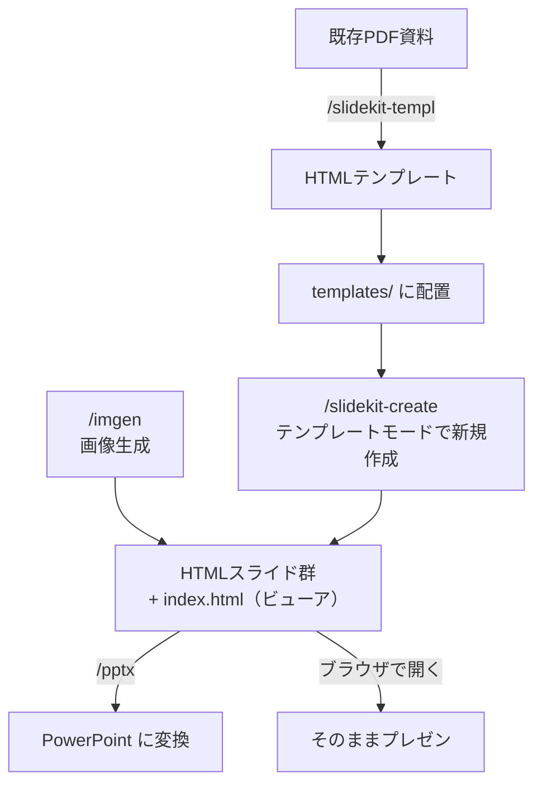

# SlideKit

[Claude Code](https://docs.anthropic.com/en/docs/claude-code) 用のプレゼンテーションスライド制作ツールキットです。

対話形式でHTMLスライドを新規作成し、ブラウザでそのままプレゼンできます。既存PDFのHTML化や PowerPoint（PPTX）変換にも対応しています。

---

## 目次

- [できること](#できること)
- [インストール](#インストール)
- [クイックスタート](#クイックスタート)
- [スキル一覧](#スキル一覧)
  - [/slidekit-create — スライド新規作成](#slidekit-create--スライド新規作成)
  - [/slidekit-templ — PDFからテンプレート作成](#slidekit-templ--pdfからテンプレート作成)
  - [/pptx — PowerPoint変換](#pptx--powerpoint変換)
  - [/imgen — AI画像生成](#imgen--ai画像生成)
- [付属テンプレート（11種類）](#付属テンプレート11種類)
- [ディレクトリ構成](#ディレクトリ構成)
- [よくある質問](#よくある質問)
- [ライセンス](#ライセンス)

---

## できること



| やりたいこと | 使うスキル |
|-------------|-----------|
| 新しいプレゼン資料を作りたい | `/slidekit-create` |
| 既存PDFのデザインを再利用したい | `/slidekit-templ` → `/slidekit-create` |
| HTMLスライドをPowerPointにしたい | `/pptx` |
| スライド用の画像を生成したい | `/imgen` |

---

## インストール

### 前提条件

- [Claude Code](https://docs.anthropic.com/en/docs/claude-code) がインストール済みであること

### Step 1: 全スキルを一括インストール

```bash
claude install-skill https://github.com/nogataka/SlideKit
```

これだけで `/slidekit-create`、`/slidekit-templ`、`/pptx`、`/imgen` の4つが使えるようになります。

### Step 2: 個別にインストールしたい場合（任意）

特定のスキルだけ使いたい場合は、個別にインストールできます。

```bash
# スライド新規作成のみ
claude install-skill https://github.com/nogataka/SlideKit/tree/main/skills/slidekit-create

# PDFテンプレート化のみ
claude install-skill https://github.com/nogataka/SlideKit/tree/main/skills/slidekit-templ

# PPTX変換のみ
claude install-skill https://github.com/nogataka/SlideKit/tree/main/skills/pptx

# AI画像生成のみ
claude install-skill https://github.com/nogataka/SlideKit/tree/main/skills/imgen
```

### Step 3: インストールの確認

Claude Code を起動し、スラッシュコマンドが認識されることを確認します。

```
/slidekit-create
```

> ヒアリングの質問が表示されればインストール成功です。

### アンインストール

```bash
rm -rf ~/.claude/skills/slidekit-create
rm -rf ~/.claude/skills/slidekit-templ
rm -rf ~/.claude/skills/pptx
rm -rf ~/.claude/skills/imgen
```

---

## クイックスタート

### 1. スライドを作る

Claude Code で以下のいずれかを入力します。

```
/slidekit-create
```

```
プレゼン資料を作ってください
```

Claude が一問一答形式で質問してきます。番号で回答していくだけで、スライドが生成されます。

```
質問例:
> 「スタイルを選択してください。番号で回答してください。」
> 1. Creative  2. Elegant  3. Modern  4. Professional  5. Minimalist

回答: 3
```

### 2. ブラウザで確認する

生成された `index.html` をブラウザで開きます。

```bash
open output/slide-page01/index.html
```

| 操作 | キー |
|------|------|
| 次のスライド | → / ↓ / Space / クリック |
| 前のスライド | ← / ↑ |
| フルスクリーン | F |
| PDF書き出し | PDF ボタン |

### 3. PowerPointに変換する（任意）

スライド生成後、Claude が「PPTXに変換しますか？」と聞きます。「はい」で自動変換されます。

手動で変換する場合:

```
output/slide-page01/ のHTMLスライドをPPTXに変換してください
```

---

## スキル一覧

### /slidekit-create — スライド新規作成

HTMLスライドプレゼンテーションをゼロから作成します。

#### 仕様

- **1スライド = 1 HTMLファイル**（1280 x 720px）
- Tailwind CSS + Font Awesome + Google Fonts（CDN経由）
- 純粋な HTML + CSS（データ可視化が必要な場合のみ Chart.js を使用）
- `index.html` でブラウザからそのままプレゼン可能
- PPTX変換を考慮したDOM構造

#### 対話の流れ

すべての質問は**一問一答形式**で、選択肢は**番号入力**で回答します。

| Phase | やること |
|-------|---------|
| 0. テンプレート検出 | `templates/` にカスタムテンプレートがあればモード選択 |
| 1. ヒアリング | スタイル、テーマ、内容ソース、枚数などを質問 |
| 2. デザイン決定 | カラーパレット・フォント・アイコンを確定 |
| 3. スライド構成 | 各スライドの役割・レイアウトパターンを計画 |
| 4. HTML生成 | `001.html` 〜 `NNN.html` を出力 |
| 5. index.html生成 | ナビゲーション付きビューアを出力 |
| 6. チェックリスト | 品質基準への適合を検証 |
| 7. PPTX変換（任意） | `/pptx` スキルで PowerPoint に変換 |

#### スタイル × テーマの組み合わせ

**5種類のスタイル:**

| スタイル | 特徴 |
|---------|------|
| Creative | 大胆な配色、グラデーション、遊び心のあるレイアウト |
| Elegant | 落ち着いたパレット（ゴールド系）、広めの余白 |
| Modern | フラットデザイン、鮮やかなアクセント、テック志向 |
| Professional | ネイビー/グレー系、構造的、情報密度高め |
| Minimalist | 少ない色数、極端な余白、タイポグラフィ主導 |

**5種類のテーマ:**

| テーマ | 用途 |
|-------|------|
| Marketing | 製品発表、キャンペーン提案、市場分析 |
| Portfolio | ケーススタディ、実績紹介、作品集 |
| Business | 事業計画、経営レポート、戦略提案、投資家ピッチ |
| Technology | SaaS紹介、技術提案、DX推進、AI/データ分析 |
| Education | 研修資料、セミナー、ワークショップ |

#### 43種類のレイアウトパターン

カバー、セクション区切り、2カラム、3カラム、タイムライン、KPIダッシュボード、ファネル、グリッドテーブル、2×2グリッド、2×3グリッド、TAM/SAM/SOM、VS比較、ガラスパネル、引用スライド、企業事例など、43種類のレイアウトを使い分けて多彩なスライドを生成します。

#### カスタムテンプレート機能

自作のHTMLスライドをデザインの参考資料として登録できます。登録すると、デザイン関連のヒアリングがスキップされ、テンプレートのカラー・フォント・装飾を引き継いだスライドが生成されます。

**テンプレートの配置先:**

```
~/.claude/skills/slidekit-create/references/templates/
```

**配置方法（2パターン）:**

```
# パターンA: 単一テンプレート — 直下にHTMLを置く
templates/
├── 001.html
├── 002.html
└── README.md

# パターンB: 複数テンプレート — サブディレクトリで分類
templates/
├── navy-gold/
│   ├── 001.html
│   └── 002.html
├── modern-tech/
│   ├── 001.html
│   └── 002.html
└── README.md
```

> 1テンプレートセットあたり最大5ファイル。テキスト内容はコピーされず、ビジュアルデザインのみ抽出されます。

---

### /slidekit-templ — PDFからテンプレート作成

既存のPDFプレゼンテーションをHTMLスライドに変換し、`/slidekit-create` のカスタムテンプレートとして登録できます。

#### 変換の流れ

```
PDF → (pdftoppm) → スライド画像（JPEG）
                        ↓
    Claude が各画像を読み取り → HTMLを作成
                        ↓
         001.html, 002.html, ... + index.html
```

#### 前提条件

Poppler（`pdftoppm` コマンド）が必要です。

```bash
# macOS
brew install poppler

# Ubuntu / Debian
sudo apt-get install poppler-utils

# Windows (chocolatey)
choco install poppler
```

#### 使い方

```
/slidekit-templ
```

または:

```
このPDFからテンプレートを作ってください: ./presentation.pdf
```

#### テンプレートとして登録する

生成されたHTMLの中から参考にしたいファイルをコピーします。

```bash
# サブディレクトリで管理する場合
mkdir -p ~/.claude/skills/slidekit-create/references/templates/my-design
cp output/templ/*.html ~/.claude/skills/slidekit-create/references/templates/my-design/
```

登録後、`/slidekit-create` を実行するとテンプレートが検出され、使用するか確認されます。

---

### /pptx — PowerPoint変換

HTMLスライドを PowerPoint（`.pptx`）に変換します。

`/slidekit-create` のワークフロー完了後に自動で変換を提案されますが、手動で呼び出すこともできます。

```
/pptx
```

```
output/slide-page01/ のHTMLスライドをPPTXに変換してください
```

> SlideKit のHTMLはPPTX変換を前提としたDOM構造で生成されるため、高い変換精度が得られます。複雑なCSSグラデーションや Chart.js チャートの一部はスクリーンショットとして埋め込まれる場合があります。

---

### /imgen — AI画像生成

スライド用の画像をAIで生成します（Azure OpenAI gpt-image-1.5 を使用）。

```
/imgen
```

生成した画像はスライド内の画像素材として利用できます。

> 詳細・設定方法・API仕様については [nogataka/imgen](https://github.com/nogataka/imgen) リポジトリを参照してください。

---

## 付属テンプレート（11種類）

`slide-templates/` に11種類のHTMLスライドテンプレートが同梱されています。

| ニックネーム | 用途 |
|-------------|------|
| abc-navy | ビジネスプレゼン基本（Navy+Gold） |
| venture-split | ベンチャー向けピッチ（Orange+Green） |
| biz-plan-blue | 事業計画書（Blue+Amber） |
| greenfield | 新規事業提案（Forest Green） |
| novatech | スタートアップ紹介（Navy+Orange） |
| skyline | 次世代ビジネス戦略（Cyan+Red） |
| ai-proposal | AI導入プロジェクト提案書 |
| customer-experience | 顧客体験・CX提案 |
| ai-tech | AI技術プレゼン |
| marketing-research | 市場調査レポート |
| digital-report | デジタルビジネス戦略レポート |

#### テンプレートの使い方

```bash
# 例: navy-gold テンプレートを登録
cp -r slide-templates/abc-navy/ ~/.claude/skills/slidekit-create/references/templates/abc-navy/
```

登録後、`/slidekit-create` を実行するとテンプレートが検出されます。詳細は [slide-templates/README.md](slide-templates/README.md) を参照してください。

---

## ディレクトリ構成

```
SlideKit/
├── README.md                        ← このファイル
├── skills/
│   ├── slidekit-create/             # /slidekit-create スキル
│   │   ├── SKILL.md                 #   スキル定義（ワークフロー・制約・ルール）
│   │   └── references/
│   │       ├── index-template.html  #   ビューアのテンプレート
│   │       ├── patterns.md          #   43レイアウトパターンのDOM定義
│   │       └── templates/           #   カスタムテンプレート置き場
│   ├── slidekit-templ/              # /slidekit-templ スキル
│   │   ├── SKILL.md
│   │   └── scripts/
│   │       └── pdf_to_images.py     #   PDF → JPEG 変換スクリプト
│   ├── pptx/                        # /pptx スキル
│   ├── imgen/                       # /imgen スキル
│   └── WORKFLOW.md                  # スキル間連携の説明
├── slide-templates/                 # 付属テンプレート集（11種類）
├── examples/                        # 生成サンプル
│   ├── slide-page01/                #   18枚のサンプルデッキ
│   └── slide-page02/                #   20枚のサンプルデッキ
└── docs/
```

---

## よくある質問

### スキルはどこにインストールされますか？

`~/.claude/skills/` 配下にインストールされます。

```
~/.claude/skills/slidekit-create/SKILL.md
~/.claude/skills/slidekit-templ/SKILL.md
~/.claude/skills/pptx/SKILL.md
~/.claude/skills/imgen/SKILL.md
```

### 生成されたスライドをブラウザでプレゼンするには？

生成される `index.html` をブラウザで開いてください。矢印キーでスライド送り、F キーでフルスクリーン、PDF ボタンで印刷できます。

### HTMLスライドをPDF化するには？

`index.html` をブラウザで開き、PDF ボタンをクリック、またはブラウザの印刷機能（Ctrl/Cmd + P）から「PDFとして保存」を選択してください。「背景のグラフィック」をON、余白を「なし」に設定すると綺麗に出力されます。

### slidekit-templ と slidekit-create の違いは？

| | slidekit-templ | slidekit-create |
|---|---|---|
| **入力** | 既存のPDFファイル | ユーザーへのヒアリング |
| **目的** | PDFのデザインをHTMLで再現 | 新しいスライドをゼロから作成 |
| **用途** | 既存資料のデザインを流用したいとき | 新しいプレゼンを作りたいとき |

2つを組み合わせると、既存PDFのデザインを踏襲しつつ新しい内容のスライドを作成できます。

---

## ライセンス

MIT
