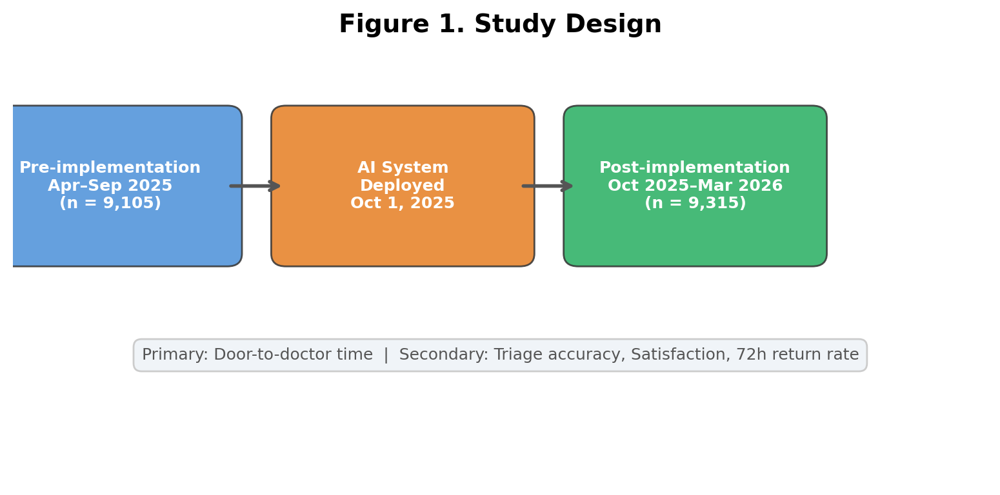
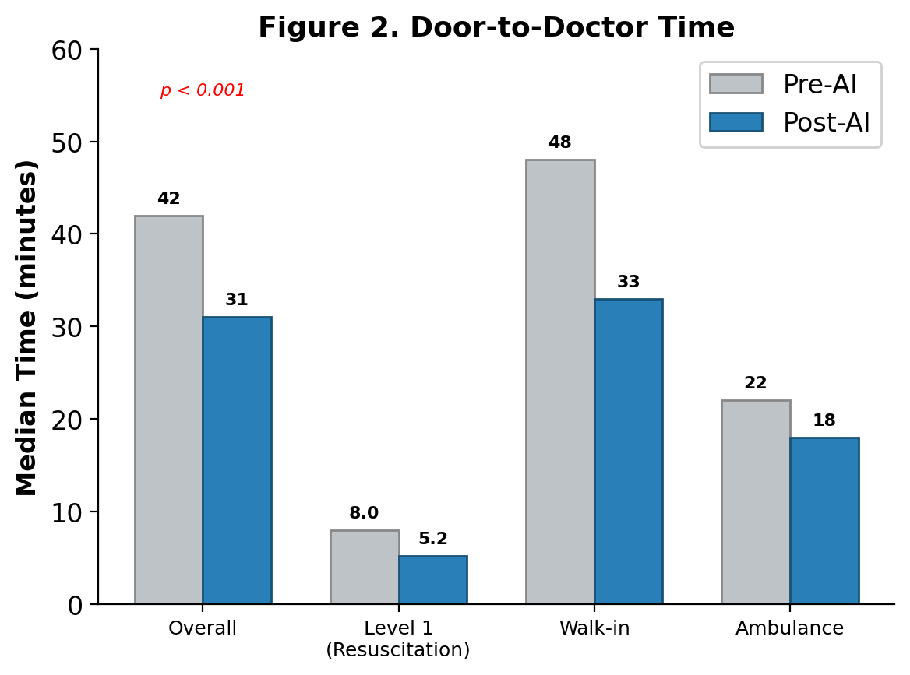
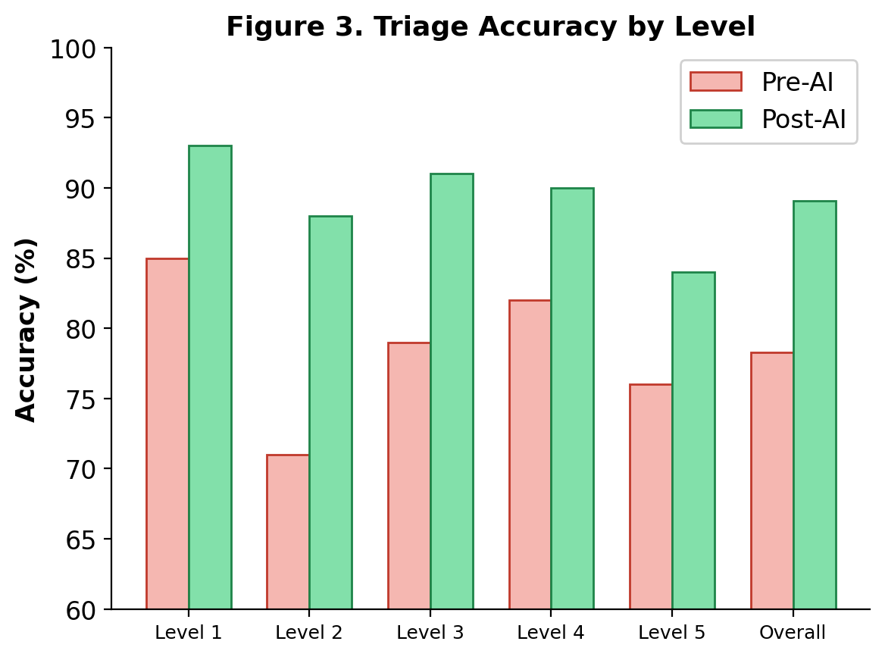
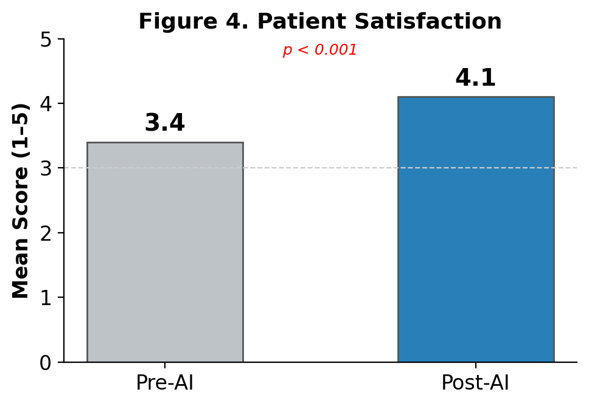

# Effect of AI-Assisted Triage on Emergency Department Wait Times: A Single-Center Prospective Study

## Authors
Takeshi Yamamoto¹, Yuki Sato¹, Haruka Tanaka², Kenji Watanabe¹

¹ Department of Emergency Medicine, Sakura General Hospital, Tokyo, Japan
² Department of Medical Informatics, Sakura General Hospital, Tokyo, Japan

## Abstract

**Background:** Emergency department (ED) overcrowding remains a critical issue in Japanese hospitals. AI-assisted triage systems have shown promise in improving patient flow, but real-world evidence from Japanese EDs is limited.

**Methods:** We conducted a prospective before-and-after study at a single tertiary ED over 12 months (April 2025–March 2026). An AI triage support system was implemented in October 2025. The system analyzed chief complaints, vital signs, and brief history to suggest triage levels (1–5) in real-time. Primary outcome was median door-to-doctor time. Secondary outcomes included triage accuracy, patient satisfaction, and 72-hour unplanned return rate.

**Results:** A total of 18,420 ED visits were included (9,105 pre-implementation; 9,315 post-implementation). Median door-to-doctor time decreased from 42 minutes (IQR 28–67) to 31 minutes (IQR 19–48) (p < 0.001). Triage accuracy improved from 78.3% to 89.1% (p < 0.001). The 72-hour return rate remained stable (4.2% vs 4.0%, p = 0.52). Patient satisfaction scores increased from 3.4/5.0 to 4.1/5.0 (p < 0.001). Among Level 1 (resuscitation) patients, time to physician assessment decreased by 35% (8 min → 5.2 min).

**Conclusions:** AI-assisted triage significantly reduced ED wait times and improved triage accuracy without increasing adverse outcomes. This approach may be particularly valuable for understaffed Japanese EDs facing increasing patient volumes.

## Introduction

Emergency departments in Japan face growing pressure from aging demographics and increasing patient volumes. The 2024 Ministry of Health report documented a 15% increase in ED visits over the past decade, while emergency physician staffing has grown by only 3%.

Triage—the process of prioritizing patients by clinical urgency—is a critical bottleneck. Traditional nurse-led triage relies heavily on individual experience and can be inconsistent across shifts. Undertriage (assigning lower priority than warranted) can delay treatment for critically ill patients, while overtriage increases wait times for all.

AI-based clinical decision support systems have demonstrated potential in various medical domains. Recent studies from the US and Europe have shown that machine learning models can predict triage acuity with accuracy comparable to experienced emergency nurses. However, data from Japanese EDs—where patient demographics, disease patterns, and workflow differ significantly—remain scarce.

We hypothesized that implementing an AI triage support system would reduce door-to-doctor time while maintaining or improving triage accuracy.

## Methods

### Study Design and Setting
This was a prospective before-and-after study conducted at Sakura General Hospital, a 650-bed tertiary care center in Tokyo, Japan. The ED handles approximately 18,000 visits annually. The study period was April 2025 to March 2026, with AI implementation on October 1, 2025 (Fig. 1).

### AI Triage System
The system was developed using a gradient-boosted decision tree model trained on 150,000 anonymized ED records from 12 Japanese hospitals. Input features included:
- Chief complaint (free text, processed by NLP)
- Vital signs (heart rate, blood pressure, SpO2, temperature, respiratory rate)
- Age, sex, and arrival mode (ambulance vs walk-in)
- Time of presentation

The model output a suggested triage level (1–5, per Japan Triage and Acuity Scale) with a confidence score. Triage nurses could accept or override the suggestion.

### Outcomes
- Primary: Median door-to-doctor time
- Secondary: Triage accuracy (compared to final disposition), patient satisfaction (5-point Likert), 72-hour unplanned return rate, nurse override rate

### Statistical Analysis
Continuous variables were compared using Mann-Whitney U test. Categorical variables were compared using chi-square test. A p-value < 0.05 was considered significant.

## Results

### Patient Characteristics
A total of 18,420 ED visits were analyzed. Patient demographics were similar between periods (mean age 58.2 vs 57.8 years; 52% male in both periods).

### Primary Outcome
Median door-to-doctor time decreased significantly from 42 minutes (IQR 28–67) to 31 minutes (IQR 19–48) after AI implementation (p < 0.001), representing a 26% reduction (Fig. 2).

### Secondary Outcomes
Triage accuracy improved from 78.3% to 89.1% (p < 0.001). The improvement was most pronounced for Level 2 (emergent) patients, where accuracy rose from 71% to 88% (Fig. 3).

Patient satisfaction scores increased from 3.4/5.0 to 4.1/5.0 (p < 0.001) (Fig. 4). The 72-hour unplanned return rate remained stable at 4.2% vs 4.0% (p = 0.52), suggesting no increase in premature discharges.

Triage nurses overrode the AI suggestion in 12.3% of cases. Override accuracy was 76%, indicating that nurse clinical judgment remained valuable for edge cases.

### Subgroup Analysis
Among Level 1 patients (n = 412), median time to physician assessment decreased from 8.0 minutes to 5.2 minutes (35% reduction). Among walk-in patients, door-to-doctor time decreased by 32% (48 → 33 min), while ambulance arrivals showed a 19% reduction (22 → 18 min).

## Discussion

Our study demonstrates that AI-assisted triage can significantly improve ED efficiency in a Japanese hospital setting. The 26% reduction in door-to-doctor time is clinically meaningful and comparable to improvements reported in Western studies.

Several factors may explain the improvement. First, the AI system reduced triage decision time by providing an immediate suggestion, allowing nurses to focus on clinical assessment rather than algorithmic scoring. Second, improved triage accuracy meant fewer patients were mis-prioritized, reducing downstream delays.

The 12.3% override rate suggests appropriate human-AI collaboration. Nurses did not blindly follow AI suggestions but exercised clinical judgment, particularly for atypical presentations. The 76% override accuracy indicates room for model improvement in edge cases.

### Limitations
This study has several limitations. First, the before-and-after design cannot fully account for temporal confounding. Second, the single-center setting limits generalizability. Third, the 6-month post-implementation period may not capture long-term effects or adaptation patterns. Fourth, we did not assess the impact on specific diagnoses or disease categories.

### Future Directions
Multicenter validation studies are needed to confirm these findings across diverse Japanese ED settings. Integration of additional data sources (e.g., prior visit history, medication lists) may further improve model performance.

## Conclusion

AI-assisted triage significantly reduced emergency department wait times and improved triage accuracy at a Japanese tertiary hospital without increasing adverse events. This technology represents a practical approach to addressing ED overcrowding in Japan's aging society.
