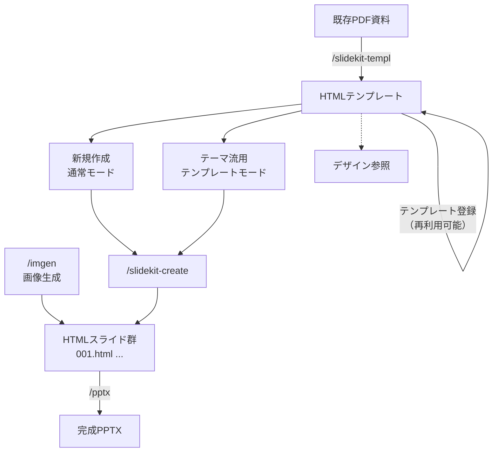
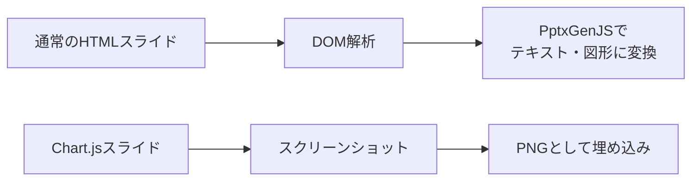
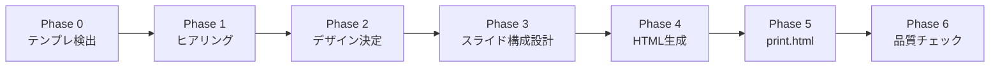

# HTML→PPTXプレゼンテーション生成パイプライン

## このドキュメントについて

プレゼンテーション資料を作るとき、最終的に必要なのはPowerPointファイルであることが多い。しかし、PowerPointのXML構造を直接扱うのは複雑で、デザインの自由度も低い。

本パイプラインでは、この問題を「HTMLを中間表現として使う」ことで解決する。ブラウザで確認できるHTMLスライドを生成し、それをPowerPointに変換する。HTMLなら Tailwind CSSで自由にレイアウトが組め、ブラウザで即座にプレビューでき、バージョン管理もテキストベースで行える。

ただし、HTMLとPowerPointは構造が根本的に異なる。この変換ギャップを埋めるために、HTML側に制約を設け、43種類のレイアウトパターンを事前定義し、変換精度を保証する仕組みを構築した。

## パイプラインの全体像

4つのスキルが連携して動作する。

| スキル | 役割 | 入力 → 出力 |
|--------|------|-------------|
| `slidekit-create` | HTMLスライドをゼロから生成 | テーマ・要件 → HTML |
| `slidekit-templ` | 既存PDFをHTMLテンプレートに変換 | PDF → HTML |
| `pptx` | HTMLをPowerPointに変換 | HTML → PPTX |
| `imgen` | スライド用の画像を生成 | テキスト → PNG |



---

## 1. なぜHTMLを中間表現にするのか

PowerPointを直接生成するアプローチには2つの選択肢がある。PptxGenJS等のライブラリでプログラマティックに組む方法と、テンプレートPPTXのXMLを直接編集する方法である。前者はレイアウトの表現力に限界があり、後者はXML構造の複雑さに悩まされる。

本パイプラインでは第三の道を選んだ。各スライドを独立したHTMLファイル（1280×720px）として生成し、最後にPowerPointへ変換する。

```html
<!DOCTYPE html>
<html lang="ja">
<head>
  <meta charset="utf-8" />
  <meta content="width=device-width, initial-scale=1.0" name="viewport" />
  <title>市場分析</title>
  <!-- Tailwind CSS -->
  <link href="https://cdn.jsdelivr.net/npm/tailwindcss@2.2.19/dist/tailwind.min.css"
        rel="stylesheet" />
  <!-- Font Awesome -->
  <link href="https://cdn.jsdelivr.net/npm/@fortawesome/fontawesome-free@6.4.0/css/all.min.css"
        rel="stylesheet" />
  <!-- Google Fonts -->
  <link href="https://fonts.googleapis.com/css2?family=Noto+Sans+JP:wght@300;400;500;700;900&family=Lato:wght@400;600;700&display=swap"
        rel="stylesheet" />
  <style>
    body { margin: 0; padding: 0; font-family: 'Noto Sans JP', sans-serif; overflow: hidden; }
    .font-accent { font-family: 'Lato', sans-serif; }
    .slide { width: 1280px; height: 720px; position: relative; overflow: hidden; }
  </style>
</head>
<body>
  <div class="slide">
    <!-- スライド内容 -->
  </div>
</body>
</html>
```

この設計には3つの利点がある。

- **並行生成**：各スライドが自己完結しているため、独立して生成・修正できる
- **即時プレビュー**：HTMLファイルをブラウザで開けばそのまま確認できる
- **diff管理**：テキストベースなのでGitで差分管理が容易

---

## 2. PPTX変換から逆算したHTML制約

このパイプラインの設計上の要は、HTML生成とPPTX変換を分離しつつ、両者の整合性を保つことにある。HTMLの自由度が高すぎるとPowerPointに変換できない。そこで、HTML側に以下の制約を設けている。

| 制約 | 理由 |
|------|------|
| テキストは`<p>`/`<h*>`で記述し、`<div>`内テキストを避ける | PptxGenJSがテキスト要素として認識できる |
| `::before`/`::after`擬似要素にテキストを入れない | 擬似要素はDOMツリーに存在しないため変換不能 |
| DOM階層を5〜6レベルに抑える | 深いネストは座標計算の精度を落とす |
| Font Awesomeアイコンは`<i>`タグ＋`fa-`クラス | コンバータがクラス名でアイコンを検出する |
| `<table>`を使わずflex-basedレイアウトにする | テーブルのセル結合はPPTX変換で崩れやすい |
| 装飾要素（背景円、グラデーション）に`-z-10`/`z-0`を付与 | コンテンツレイヤーと装飾レイヤーを分離する |

### Chart.jsの例外処理

データ可視化が必要なスライドでは、唯一の例外としてChart.jsを許可している。ただし`<canvas>`要素はDOM解析できないため、PPTX変換時にはスクリーンショットをPNG画像として埋め込む。



### 変換後の自動修正

PptxGenJSが生成するPPTXには既知の構造的問題が14件ある。`fix_pptx.py`でこれらを自動修正する。

```bash
python fix_pptx.py output.pptx
```

修正対象：phantom slideMaster、invalid adj guides、missing effectLst、empty ln elementsなど。

---

## 3. デザインの再現性を担保する仕組み

### カラーパレットの固定

AIにスライドを生成させると、スライドごとに配色が揺らぐ問題が起きる。これを防ぐため、デッキ全体で使う色を3〜4色に限定し、Tailwindユーティリティクラスとして最初に定義する。

```css
.bg-brand-dark  { background-color: #1B3A5C; }  /* タイトル、濃い背景 */
.bg-brand-accent { background-color: #2D8B7A; }  /* ボーダー、ハイライト */
.bg-brand-warm  { background-color: #E8A84C; }  /* CTA、バッジ */
.text-brand-dark  { color: #1B3A5C; }
.text-brand-accent { color: #2D8B7A; }
.text-brand-warm  { color: #E8A84C; }
```

実績のあるパレットを10組用意している。

| パレット名 | Primary Dark | Accent | Warm/Secondary |
|-----------|-------------|--------|----------------|
| Midnight Executive | `#1B2A4A` Navy | `#C9A84C` Gold | `#F5F1E8` Ivory |
| Forest & Moss | `#2D4A3E` Forest | `#8FB573` Moss | `#F2EDE4` Cream |
| Coral Energy | `#FF6B6B` Coral | `#FFD93D` Gold | `#1B2A4A` Navy |
| Ocean Gradient | `#0A1628` Deep Blue | `#0EA5E9` Sky | `#64748B` Slate |
| Warm Terracotta | `#C2714F` Terracotta | `#E8D5B7` Sand | `#7B9E6B` Sage |

### フォントペアリング

日本語フォント（本文・見出し）と欧文フォント（数値・ラベル・ページ番号）を組み合わせる。

| 日本語（Primary） | 欧文（Accent） | 印象 |
|-------------------|---------------|------|
| Noto Sans JP | Lato | ニュートラル、万能 |
| BIZ UDGothic | Inter | ビジネス、堅実 |
| Noto Sans JP | Roboto | テクノロジー、モダン |

### バイリンガル見出し

英語ラベルを小さく添えることで、ビジネス資料としての体裁を整える。

```html
<p class="text-xs uppercase tracking-widest text-gray-400 mb-1 font-accent">
  Market Analysis
</p>
<h1 class="text-3xl font-bold text-brand-dark">市場分析</h1>
```

---

## 4. 43のレイアウトパターン

AIに「自由にレイアウトして」と指示すると、タイトル＋箇条書きの単調なスライドが量産される。これを解決するため、43種類のレイアウトパターンをDOM構造として事前定義し、スライド構成設計の際にパターン番号で指定する仕組みにした。

**A. 基本レイアウト（1〜7）**

| # | パターン名 | 用途 |
|---|-----------|------|
| 1 | Center | 表紙、Thank You |
| 2 | Left-Right Split | 対比、Before/After |
| 3 | Header-Body-Footer (HBF) | 汎用コンテンツ |
| 4 | HBF + 2-Column | 二項目の並列比較 |
| 5 | HBF + 3-Column | 三要素の紹介 |
| 6 | HBF + N-Column | プロセスフロー |
| 7 | Full-bleed | グラデーション背景、画像オーバーレイ |

**B. HBF応用（8〜20）**

| # | パターン名 | 用途 |
|---|-----------|------|
| 8 | HBF + Top-Bottom Split | 上下分割 |
| 9 | HBF + Timeline | ロードマップ、沿革 |
| 10 | HBF + KPI Dashboard | 数値指標の一覧 |
| 11 | HBF + Grid Table | データ表 |
| 12 | HBF + Funnel | 営業パイプライン、コンバージョン |
| 13 | HBF + Vertical Stack | 積み上げ型リスト |
| 14 | HBF + 2×2 Grid | 4象限マトリクス |
| 15 | HBF + Stacked Cards | カード型情報 |
| 16 | HBF + TAM/SAM/SOM | 市場規模の同心円 |
| 17 | Chapter Divider | セクション区切り |
| 18 | HBF + Contact | 問い合わせ先 |
| 19 | HBF + 5-Column Process | 5段階プロセス |
| 20 | HBF + VS Comparison | A vs B 比較 |

**C. セクション系（21〜22）**

| # | パターン名 | 用途 |
|---|-----------|------|
| 21 | Section End / Summary | セクション終了、要点まとめ |
| 22 | Table of Contents | 目次、アジェンダ |

**D. グリッド・リスト系（23〜24）**

| # | パターン名 | 用途 |
|---|-----------|------|
| 23 | HBF + 2×3 Grid | 6要素の整理 |
| 24 | HBF + Icon List | アイコン付きリスト |

**E. パネルデザイン系（25〜29）**

| # | パターン名 | 用途 |
|---|-----------|------|
| 25 | HBF + Image Header Panel | 画像ヘッダー付きカード |
| 26 | HBF + Emphasis Panel | 左ボーダー強調パネル |
| 27 | Glass Panel (Dark) | ガラス風パネル（暗背景） |
| 28 | HBF + Gradient Panel | グラデーションパネル |
| 29 | HBF + Card Layout with Image | アイコン付きカード型 |

**F. 背景・画像系（30, 32）**

| # | パターン名 | 用途 |
|---|-----------|------|
| 30 | Right-Side Background Image | 左テキスト＋右画像 |
| 32 | Multiple Images Split | 複数画像の横並び |

**G. 引用・強調系（31, 33〜37）**

| # | パターン名 | 用途 |
|---|-----------|------|
| 31 | Quote Slide | 引用文の中央配置 |
| 33 | Statistics Emphasis | 大きな数値の強調 |
| 34 | Center Message | 一言メッセージ |
| 35 | Q&A Slide | 質疑応答の橋渡し |
| 36 | Question Slide | 聴衆への問いかけ |
| 37 | Movie / Book Quote | 映画・書籍からの引用 |

**H. 混合レイアウト系（38〜40）**

| # | パターン名 | 用途 |
|---|-----------|------|
| 38 | HBF + Inline Image | 画像＋番号付きテキスト |
| 39 | HBF + Statistics Ratio | 縦棒グラフ比較 |
| 40 | HBF + Text + Stats Panel | テキスト＋統計カード混合 |

**I. まとめ・事例系（41〜43）**

| # | パターン名 | 用途 |
|---|-----------|------|
| 41 | Summary Glass Vertical | ガラス風まとめ（暗背景） |
| 42 | HBF + Simple List + Supplement | 箇条書き＋補足パネル |
| 43 | HBF + Case Study | 企業事例（課題→解決→成果） |

各パターンのDOM構造は`references/patterns.md`にTailwindクラス付きで定義されている。スライド構成を設計する際は、パターン番号で指定し、同じパターンが3回以上連続しないよう制御される。

例として、KPI Dashboardパターン（#10）の構造を示す。

```html
<div class="slide bg-white flex flex-col">
  <!-- Header -->
  <div class="px-12 pt-8 pb-4">
    <p class="text-xs uppercase tracking-widest text-gray-400 font-accent">Key Metrics</p>
    <h1 class="text-2xl font-bold text-brand-dark">重要指標サマリー</h1>
  </div>
  <!-- Body: KPI Cards -->
  <div class="flex-1 px-12 grid grid-cols-4 gap-6 items-center">
    <div class="bg-gray-50 rounded-xl p-6 text-center">
      <p class="text-sm text-gray-500">売上高</p>
      <p class="text-4xl font-bold text-brand-dark font-accent">¥12.5M</p>
      <p class="text-xs text-green-500 mt-1">▲ 15% YoY</p>
    </div>
    <!-- ... 他のKPIカード -->
  </div>
  <!-- Footer -->
  <div class="px-12 py-3 flex justify-between text-xs text-gray-400">
    <span>Company Name</span>
    <span class="font-accent">4</span>
  </div>
</div>
```

---

## 5. slidekit-createの7フェーズ

`slidekit-create`は、ヒアリングからHTML生成までを7フェーズで進行する。



### Phase 0：テンプレート検出

`references/templates/`をスキャンし、カスタムテンプレートがあればテンプレートモードに切り替わる。テンプレートモードではデザイン関連の質問（スタイル・テーマ・配色）がスキップされる。

### Phase 1：ヒアリング

1問1答形式でユーザーに要件を聞く。通常モードの質問項目：

1. 出力ディレクトリ
2. コンテンツソース（テキストファイル or 口頭説明）
3. プレゼンタイトル
4. スライド枚数
5. 会社名・ロゴ
6. スタイル選択（Creative / Elegant / Modern / Professional / Minimalist）
7. テーマ選択（Marketing / Portfolio / Business / Technology / Education）
8. カラー希望
9. 背景画像の有無

### Phase 2：デザイン決定

ヒアリング結果からカラーパレット（3〜4色）、フォントペア（日本語＋欧文）、ブランドアイコン（Font Awesome）を確定する。

### Phase 3：スライド構成設計

コンテンツを分析し、各スライドに43パターンから最適なレイアウトを割り当てる。

### Phase 4：HTML生成

各スライドを`NNN.html`（001.html, 002.html, ...）として出力する。

### Phase 5：print.html生成

全スライドをiframeで並べた一覧ページを生成する。俯瞰確認と印刷に使用する。

### Phase 6：品質チェック

CDNリンク、カラーパレットの一貫性、DOM構造（`.slide`ラッパー）、ファイル数、フォント、フッター・ページ番号を自動検証する。

---

## 6. PDFからのデザイン抽出（slidekit-templ）

既存のプレゼンテーションPDFからデザインを抽出し、HTMLテンプレートとして再利用する機能。PDFを画像に変換し、各スライド画像をClaude Visionで読み取ってHTMLを書き起こす。

```bash
# PDFをスライド画像に分割
python scripts/pdf_to_images.py input.pdf output_dir
# 出力: slide-01.jpg, slide-02.jpg, ...
```

AIが各画像から抽出する情報：
- カラーパレット（hex値）
- フォントスタイル（セリフ/サンセリフ、ウェイト）
- ヘッダー/フッターのパターン
- 全体のスタイル分類

生成したHTMLは`slidekit-create`のテンプレートとして登録できる。

```bash
mkdir -p ~/.claude/skills/slidekit-create/references/templates/my-design
cp output/templ/00[1-5].html ~/.claude/skills/slidekit-create/references/templates/my-design/
```

登録後、テンプレートモードで起動すれば元のデザインを踏襲した新しいスライドを生成できる。1セットあたり最大5ファイル。

---

## 7. imgenによる画像生成

スライドの配色に合った画像素材を、Azure OpenAIのgpt-image-1.5で生成する。カラーパレットのhex値をプロンプトに含めることで、デッキ全体と調和した画像が得られる。

```bash
# 背景画像の生成
npm run dev --prefix <path-to-imgen> -- image gen \
  "ミニマルなテクノロジーの抽象的背景、濃紺(#1B3A5C)とティール(#2D8B7A)のグラデーション" \
  -q high -s 1536x1024 -o slides/bg-tech.png

# アイコンの生成
npm run dev --prefix <path-to-imgen> -- image gen \
  "フラットデザインのチームワークイラスト、白背景" \
  -q high -s 1024x1024 -o slides/team-icon.png

# 既存画像の配色調整
npm run dev --prefix <path-to-imgen> -- image edit \
  slides/photo.jpg "カラートーンを濃紺とゴールドに統一" \
  -s 1536x1024 -o slides/photo-adjusted.png
```

| コマンド | 用途 | 例 |
|---------|------|-----|
| `image gen` | テキストから画像生成 | 背景、アイコン、イラスト |
| `image edit` | 既存画像のAI編集 | 配色調整、背景変更、スタイル変換 |
| `image explain` | 画像の内容説明 | スライドのALTテキスト生成 |

| プリセット | サイズ | スライドでの用途 |
|-----------|--------|----------------|
| `builtin:landscape` | 1536×1024 | 全面背景、ワイド画像 |
| `builtin:square` | 1024×1024 | アイコン、マスコット、図解 |
| `builtin:portrait` | 1024×1536 | 縦型画像、人物写真 |
| `builtin:draft` | 1024×1024 (low) | ラフ案、プロトタイプ |

---

## 8. テンプレートライブラリ

11セットのHTMLテンプレートが事前に用意されている。

| テンプレート | 枚数 | テーマ | 用途 |
|------------|------|--------|------|
| abc-navy | 20 | Navy + Gold | 汎用ビジネス |
| venture-split | 18 | Orange + Green | スタートアップ提案 |
| biz-plan-blue | 20 | Blue + Amber | 事業計画書 |
| greenfield | 20 | Forest Green | 新規事業提案 |
| novatech | 20 | Navy + Orange | テック系提案 |
| skyline | 20 | Cyan + Red | 次世代戦略 |
| ai-proposal | 20 | — | AI事業提案 |
| customer-experience | 13 | M+1 font | CX変革 |
| ai-tech | 11 | — | AI技術紹介 |
| marketing-research | 10 | — | 市場調査レポート |
| digital-report | 11 | Navy + Gold | デジタル戦略 |

```bash
# テンプレートの導入
mkdir -p ~/.claude/skills/slidekit-create/references/templates/abc-navy
cp slide-templates/abc-navy/00[1-5].html \
   ~/.claude/skills/slidekit-create/references/templates/abc-navy/
```

---

## 9. ディレクトリ構成

```
SlideKit/
├── skills/
│   ├── slidekit-create/           # HTMLスライド生成スキル
│   │   ├── SKILL.md               # 7フェーズワークフロー定義（29KB）
│   │   └── references/
│   │       ├── patterns.md        # 43レイアウトパターンのDOM定義
│   │       └── templates/         # カスタムテンプレート配置場所
│   │
│   ├── slidekit-templ/            # PDF→HTMLテンプレート変換スキル
│   │   ├── SKILL.md               # 6フェーズ変換ワークフロー
│   │   └── scripts/
│   │       └── pdf_to_images.py   # PDF→JPEG変換（Poppler使用）
│   │
│   └── pptx/                      # PPTX操作スキル
│       ├── SKILL.md               # PowerPoint操作リファレンス
│       ├── pptxgenjs.md           # PptxGenJSでの新規作成ガイド
│       ├── editing.md             # テンプレート編集ワークフロー
│       └── scripts/
│           ├── add_slide.py       # スライド追加
│           ├── clean.py           # 不要ファイル削除
│           ├── thumbnail.py       # サムネイルグリッド生成
│           └── office/
│               ├── unpack.py      # PPTX→XML展開
│               ├── pack.py        # XML→PPTX再パック
│               ├── validate.py    # 構造バリデーション
│               └── soffice.py     # LibreOffice連携
│
├── slide-templates/               # 事前構築済みテンプレート（11セット）
│   ├── abc-navy/
│   ├── venture-split/
│   ├── biz-plan-blue/
│   └── ...
│
└── <path-to-imgen>/       # 画像生成CLIツール（別リポジトリ）
    ├── src/
    │   ├── commands/image/
    │   │   ├── gen.ts             # 画像生成
    │   │   ├── edit.ts            # 画像編集
    │   │   └── explain.ts         # 画像説明
    │   └── utils/
    │       ├── azure-image.ts     # Azure OpenAI画像API
    │       └── azure-chat.ts      # プロンプト拡張・ファイル名生成
    └── package.json
```

---

## 10. 利用例

### ゼロから新規作成

```
「AI事業の投資家向けピッチデッキを20枚で作って」
  → /slidekit-create が起動
  → Phase 1 でヒアリング（スタイル・テーマ・配色）
  → Phase 4 で 001.html〜020.html を生成
  → Phase 6 で品質チェック
  → /pptx で PowerPoint に変換
```

### 既存PDFのデザインを流用

```
「この企画書のデザインで新しいスライドを作りたい」
  → /slidekit-templ でPDFをHTML化
  → テンプレートとして登録
  → /slidekit-create のテンプレートモードで新規生成
```

### スライド用画像の生成

```
「この背景に合うテクノロジー感のある画像が欲しい」
  → /imgen でカラーパレットに合わせた画像を生成
  → 生成画像をHTMLスライドに配置
```

### 既存PPTXの内容差し替え

```
「このテンプレートPPTXの内容を差し替えたい」
  → /pptx のeditingワークフロー
  → unpack → スライド編集 → clean → pack
```

---

## 設計判断の背景

このパイプラインは、「最終出力がPowerPointである」という制約から逆算して設計されている。

1. **中間表現としてのHTML**：PowerPointのXMLを直接操作する代わりに、人間が読み書きできるHTMLを中間表現として採用した。Tailwind CSSによりレイアウトの表現力を確保しつつ、PPTX変換の精度を保つためにDOM構造に制約を設けている。

2. **パターンによる品質の底上げ**：43のレイアウトパターンは、単なるテンプレート集ではなく、PPTX変換の検証が済んだDOM構造の集合体である。新しいパターンを追加する際は、変換テストを通過したものだけを採用する。

3. **パイプラインの分離**：生成（slidekit-create）、変換（pptx）、素材調達（imgen）、デザイン抽出（slidekit-templ）を独立したスキルとして分離することで、各工程を単独で改善・差し替えできる構造になっている。

4. **PDFからの逆変換**：既存資料のデザインをHTMLテンプレートとして取り込む`slidekit-templ`により、デザインの資産を蓄積・再利用するサイクルが成立する。
