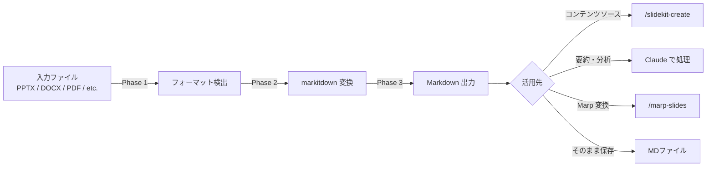

# markitdown — ファイル→Markdown 統合変換スキル

あらゆるファイル形式を Markdown に変換する。Microsoft markitdown のラッパー。
変換した MD は `slidekit-create` のコンテンツソースや、分析・要約の入力として使える。

---

## 依存パッケージ

```bash
# 全フォーマット対応（推奨）
pip install 'markitdown[all]'

# 必要なものだけ選択インストール
pip install 'markitdown[pptx]'          # PowerPoint
pip install 'markitdown[docx]'          # Word
pip install 'markitdown[xlsx]'          # Excel (.xlsx)
pip install 'markitdown[xls]'           # Excel (.xls)
pip install 'markitdown[pdf]'           # PDF
pip install 'markitdown[outlook]'       # Outlook .msg
pip install 'markitdown[audio-transcription]'  # 音声文字起こし

# OCR プラグイン（画像内テキスト抽出、要 LLM API キー）
pip install markitdown-ocr
```

---

## 対応フォーマット

| カテゴリ | 拡張子 | 抽出内容 |
|----------|--------|----------|
| **プレゼンテーション** | `.pptx` | スライドテキスト、スピーカーノート、テーブル、チャートデータ、画像 alt text |
| **文書** | `.docx` | 本文、見出し構造、テーブル、画像 alt text |
| **スプレッドシート** | `.xlsx`, `.xls` | シートごとの Markdown テーブル |
| **PDF** | `.pdf` | テキスト抽出（レイアウト保持）、テーブル検出 |
| **Web** | `.html`, `.htm` | 本文テキスト（ナビ等を除去） |
| **データ** | `.csv`, `.json`, `.xml` | 構造化テキスト / テーブル |
| **電子書籍** | `.epub` | チャプター構造付きテキスト |
| **アーカイブ** | `.zip` | 内部ファイルを再帰的に変換 |
| **メール** | `.msg` | 件名、本文、添付ファイル情報 |
| **画像** | `.jpg`, `.png`, `.gif`, `.bmp`, `.tiff`, `.webp`, `.svg` | EXIF メタデータ（OCR プラグインで本文抽出可） |
| **音声** | `.mp3`, `.wav`, `.m4a`, `.flac`, `.ogg` | 文字起こし（SpeechRecognition 使用） |

---

## ワークフロー



### Phase 1: 入力検出

ユーザーが指定したファイル（またはディレクトリ）を受け取り、フォーマットを判定する。

- 単一ファイル → 拡張子で自動判定
- ディレクトリ → 対応拡張子のファイルを全検出

### Phase 2: Markdown 変換

`convert.py` スクリプトで markitdown を実行する。

```bash
# 単体変換
python skills/markitdown/scripts/convert.py input.pptx

# 出力先を指定
python skills/markitdown/scripts/convert.py input.pptx -o output/result.md

# ディレクトリ一括変換
python skills/markitdown/scripts/convert.py input_dir/ -o output_dir/

# OCR プラグイン有効
python skills/markitdown/scripts/convert.py scanned.pdf --plugins
```

#### markitdown CLI を直接使う場合

```bash
# 標準出力に変換結果を表示
markitdown file.pptx

# ファイルに保存
markitdown file.pptx -o output.md

# パイプ入力
cat file.pdf | markitdown
```

#### Python API を直接使う場合

```python
from markitdown import MarkItDown

md = MarkItDown()
result = md.convert("presentation.pptx")
print(result.text_content)
```

### Phase 3: 出力確認と活用

変換された MD の内容を確認し、用途に応じて次のアクションを提案する。

| 変換元 | 推奨する次のアクション |
|--------|----------------------|
| PPTX → MD | `slidekit-create` でリデザイン、または内容の要約・分析 |
| DOCX → MD | コンテンツソースとして `slidekit-create` に投入 |
| PDF → MD | `slidekit-create` のヒアリング Phase 1 にコンテンツとして渡す |
| XLSX → MD | テーブルデータをスライドのパターン #11 (Grid Table) に活用 |
| 画像 → MD | EXIF 情報の確認、OCR でテキスト抽出 |
| 音声 → MD | 議事録・発表原稿としてスライド生成の入力に |

---

## PPTX 変換の出力例

```markdown
<!-- Slide number: 1 -->
# プロジェクト概要

プロジェクトXの進捗報告

### Notes:
本日は3つのトピックについて報告します。

<!-- Slide number: 2 -->
# 市場分析

| 指標 | 2024年 | 2025年 |
|------|--------|--------|
| 売上 | ¥10M | ¥15M |
| 利益率 | 12% | 18% |

### Notes:
この表は直近2年間の推移を示しています。
```

**ポイント:**
- `<!-- Slide number: N -->` でスライド境界を識別可能
- `### Notes:` でスピーカーノートが分離されている
- テーブルは Markdown 形式に自動変換

---

## 他スキルとの連携パターン

### パターン A: 既存 PPTX のリデザイン

```
1. /markitdown で PPTX → MD に変換
2. MD からコンテンツ（テキスト + ノート）を抽出
3. /slidekit-create の Phase 1 でコンテンツソースとして渡す
4. 新しいデザインで HTML スライドを生成
5. /pptx で新しい PPTX に変換
```

### パターン B: 文書からスライド生成

```
1. /markitdown で DOCX / PDF → MD に変換
2. MD の構造（見出し・段落）を分析
3. /slidekit-create でスライド構成を設計
4. HTML スライド → PPTX に変換
```

### パターン C: データをスライドに可視化

```
1. /markitdown で XLSX → MD テーブルに変換
2. データの傾向を分析
3. /slidekit-create でグラフ・KPI スライドを設計（パターン #10, #11, #39）
```

### パターン D: 競合スライドの分析

```
1. /markitdown で他社 PPTX → MD に変換
2. スライド構成・メッセージ構造を分析
3. 分析結果をもとに自社スライドの改善案を提案
```

---

## 注意事項

- **レイアウト情報は非対応**: markitdown は LLM 向けにテキストを抽出する設計。色・フォント・配置は取れない
  - デザイン情報が必要な場合は `/slidekit-templ`（PDF → HTML テンプレート）と併用する
- **アニメーション・トランジション**: PPTX のアニメーション設定は変換されない
- **画像の中身**: デフォルトでは alt text のみ。画像内テキストが必要なら `--plugins` + `markitdown-ocr` を使う
- **大容量ファイル**: ZIP 内に大量のファイルがある場合は変換に時間がかかる
- **音声文字起こし**: SpeechRecognition ベースのため、長時間音声は精度が落ちる場合がある
- **文字コード**: 出力は常に UTF-8

---

## トラブルシューティング

| 症状 | 対処 |
|------|------|
| `ModuleNotFoundError: markitdown` | `pip install 'markitdown[all]'` を実行 |
| PPTX 変換が空になる | python-pptx が入っているか確認: `pip install 'markitdown[pptx]'` |
| PDF のテーブルが崩れる | pdfplumber が入っているか確認: `pip install 'markitdown[pdf]'` |
| 画像から文字が取れない | OCR プラグインが必要: `pip install markitdown-ocr` + `--plugins` |
| 音声変換がエラー | ffmpeg がシステムにインストールされているか確認 |
